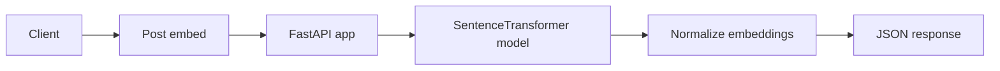

# API and deployment

## Service usage
The API serves normalized embeddings for abstracts using [FastAPI](https://fastapi.tiangolo.com/).



### Endpoints
The API exposes `GET /health` for service status and device info, and `POST /embed` to accept
`{ "abstract": "..." }` and return embedding data.

### Request and response
Request body:
```json
{ "abstract": "..." }
```

Response body:
```json
{ "embedding_dim": 384, "embedding": [0.01, 0.02] }
```

Empty or whitespace abstracts return `400`, and missing fields return `422`.

Example request:
```bash
curl -X POST http://localhost:8000/embed \
  -H "Content-Type: application/json" \
  -d "{\"abstract\": \"Graph neural networks for molecule property prediction.\"}"
```

### Model loading
The API is primarily configured via environment variables (`MODEL_PATH`, `INDEX_PATH`). It can also accept CLI flags
(`--model-path`, `--index-path`) when invoked directly. If no path is provided, it falls back to
`models/contrastive-minilm/`. The model directory must exist and contain a
[SentenceTransformer](https://www.sbert.net/) model. GPU is used when available.

### Run locally
Run the service with [Uvicorn](https://www.uvicorn.org/):
```bash
MODEL_PATH="models/your-model" INDEX_PATH="data/faiss" uv run uvicorn mlops_project.api:app \
  --host 0.0.0.0 --port 8000
```

## Deployment and containers
### Docker image
Build and run the inference container:
```bash
docker build -f dockerfiles/api.dockerfile -t mlops-api:latest .
docker run --rm -p 8000:8000 \
  -v ${PWD}/models:/app/models \
  -e MODEL_PATH=/app/models/all-MiniLM-L6-v2-mnrl-100k-balanced \
  mlops-api:latest
```

### GPU notes
If you run on Linux with NVIDIA drivers, add `--gpus all` to the container run command.

### Deployment pipeline
Cloud Build (`cloudbuild.yaml`) publishes the training image on the `build` branch after CI checks pass. See
[Cloud Build](https://cloud.google.com/build/docs) for configuration details.
The API image is built locally from `dockerfiles/api.dockerfile` unless you add a dedicated CI workflow.

### ONNX runtime
ONNX export and inference are supported via `mlops_project.model` with
[ONNX Runtime](https://onnxruntime.ai/docs/). Use the exported ONNX model for CPU-friendly deployments or batch
inference workflows.
