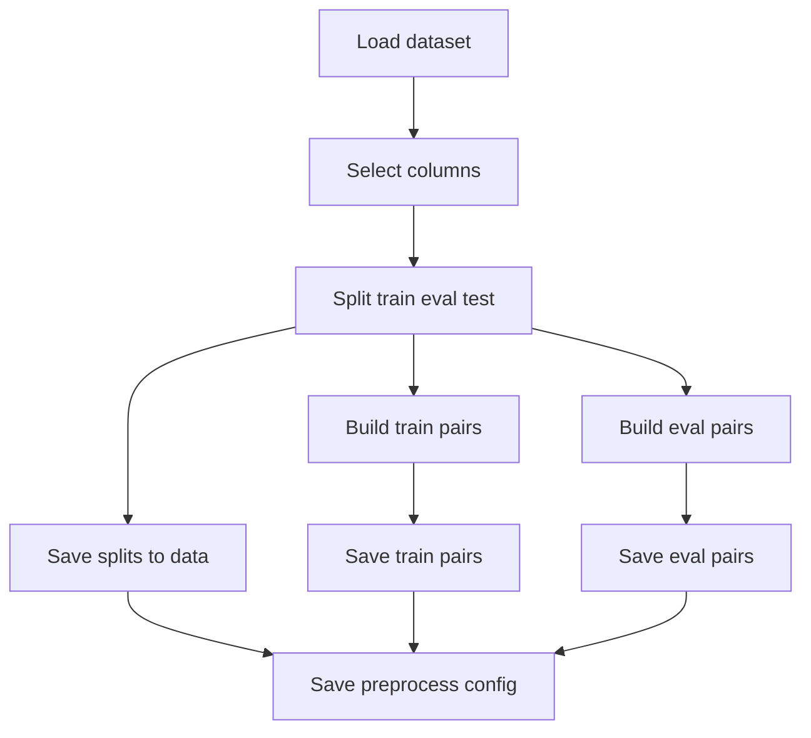

# Data and preprocessing
This page explains the dataset fields, split strategy, and pair generation used in training.

## Dataset and splits
The project uses the Hugging Face dataset [`nick007x/arxiv-papers`](https://huggingface.co/datasets/nick007x/arxiv-papers)
and loads it with [datasets](https://huggingface.co/docs/datasets/). We rely on `primary_subject` for contrastive
labels, `subjects` for metadata, and `abstract` plus `title` as text inputs.

`preprocess` creates train, eval, and test splits and stores them under `data/` in datasets format.
The split ratios and seed live in `configs/dataset.yaml` and are managed via [Hydra](https://hydra.cc/docs/intro/).

## Pairs and preprocessing workflow
Two pair building strategies are supported: `create_positive_pairs` for `MultipleNegativesRankingLoss` with
anchor/positive pairs, and `create_contrastive_pairs` for `ContrastiveLoss` with sentence pairs and labels.

The `balanced` flag controls whether subjects are sampled uniformly or weighted by frequency.

## Preprocessing flow
The diagram below shows how the raw dataset becomes saved splits and pair datasets.


**Run preprocessing**
```bash
uv run python src/mlops_project/data.py
```

Override defaults with Hydra:
```bash
uv run python src/mlops_project/data.py pairs.loss=ContrastiveLoss pairs.num_train=200000 pairs.balanced=false
```

Alternative module entrypoint:
```bash
uv run python -m mlops_project.data
```

**Output artifacts**
After preprocessing you should see `data/train`, `data/eval`, `data/test`, plus `data/train_pairs`,
`data/eval_pairs`, and `data/preprocess_config.yaml` for reproducibility checks.

`ensure_data_exists` will re-run preprocessing if the saved config no longer matches the requested config.
