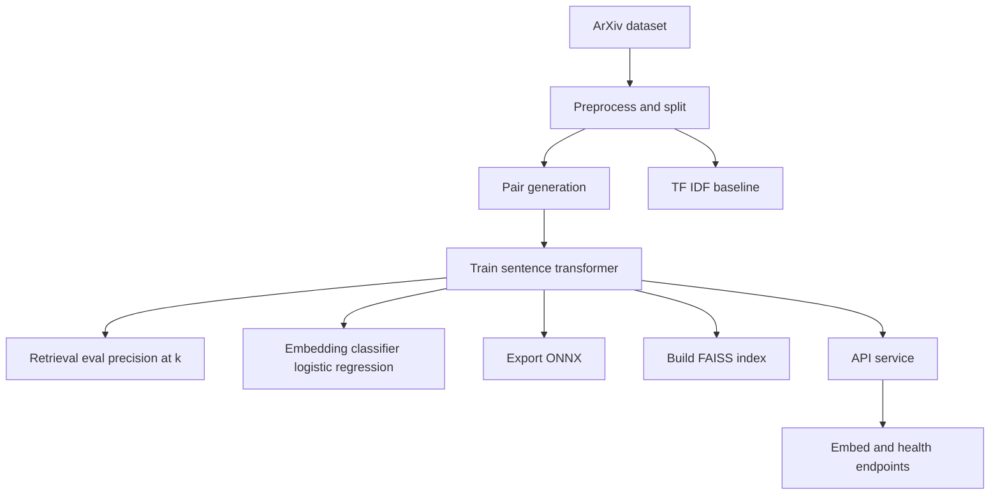

# Overview

## Goals and scope
This project fine tunes [Sentence Transformers](https://www.sbert.net/) (SBERT) models on arXiv titles and abstracts so that
papers from the same primary subject are close in embedding space, while unrelated subjects move apart. The learned
embeddings support semantic retrieval, similarity search, and embedding-based classification.

## End-to-end flow

Implemented end-to-end covers preprocessing and pair generation, training with retrieval evaluation, and lightweight
classification with TF-IDF baselines.

We build similarity search indexes with [FAISS](https://faiss.ai/), export ONNX for
[ONNX Runtime](https://onnxruntime.ai/docs/) inference alongside Sentence Transformers, and serve embeddings via a
[FastAPI](https://fastapi.tiangolo.com/) service with `/health` and `/embed`. Dockerized training and inference run
through CI checks, and we compare larger transformer backbones.

Experiment configuration is handled with [Hydra](https://hydra.cc/docs/intro/), and runs are tracked in
[Weights & Biases](https://docs.wandb.ai/) to keep results comparable across local and managed training.

Local runs are supported for development, but the project's cloud story assumes GCP as the durable backbone for storage
and managed training. Dataset state is tracked with DVC and stored in a GCS remote, so the same versioned data snapshot
can be used by both local experiments and cloud jobs without reprocessing.

Code changes flow through GitHub with pre-commit hooks locally and GitHub Actions for checks. The build job submits
`cloudbuild.yaml` so Cloud Build can use Docker to build the training image and publish it to Artifact Registry (the
container registry), then `configs/gpu_train_vertex.yaml` points Vertex AI to that image for GPU runs. The FastAPI
container can be deployed to Cloud Run for a public endpoint that clients query, while the repository stays available
for anyone who wants to clone the source and reproduce the workflow. When `meta.use_gcs=true`, training and evaluation
artifacts can be read from and written to GCS, keeping outputs aligned with the dataset version that produced them.

## Inputs, outputs, and components
Inputs are the `title` and `abstract` fields plus subject labels (`primary_subject`, `subjects`). Outputs include
trained embedding models and ONNX exports, pair datasets for contrastive learning, retrieval and classification
metrics with baseline reports, API-ready artifacts, and similarity search indexes built with
[FAISS](https://faiss.ai/).

Core components tie those pieces together. Preprocessing splits data and builds pairs, training runs with
`SentenceTransformerTrainer` and losses such as `MultipleNegativesRankingLoss` or `ContrastiveLoss`, and evaluation
uses `InformationRetrievalEvaluator` for precision@k.

Downstream tasks cover classifiers, TF-IDF baselines, similarity search over normalized embeddings, ONNX export with
[ONNX Runtime](https://onnxruntime.ai/docs/), and a [FastAPI](https://fastapi.tiangolo.com/) service that returns
normalized embeddings.

## Technology stack and dependencies
The stack below is grouped by purpose so you can scan what powers training, serving, and operations at a glance.

### Core runtime

| Area | Tools |
| --- | --- |
| Training and acceleration | [PyTorch](https://pytorch.org/docs/stable/index.html), Accelerate |
| Modeling | Transformers, [Sentence Transformers](https://www.sbert.net/) (SBERT) |
| Data | [Datasets](https://huggingface.co/docs/datasets/) |
| Config | [Hydra](https://hydra.cc/docs/intro/) |
| Serving | [FastAPI](https://fastapi.tiangolo.com/), Uvicorn |
| Tracking | [Weights & Biases](https://docs.wandb.ai/) |
| Versioning | [DVC](https://dvc.org/doc) with dvc-gdrive |
| Search and inference | [FAISS](https://faiss.ai/), [ONNX Runtime](https://onnxruntime.ai/docs/) |
| Baselines | [scikit-learn](https://scikit-learn.org/stable/) |
| Utilities | Loguru, Requests, Invoke, Typer |
| Notebooks | Jupyter |

### Dev, quality, and docs

| Area | Tools |
| --- | --- |
| Testing | pytest, coverage |
| Linting and typing | ruff, mypy |
| Automation | pre-commit |
| Docs | MkDocs, MkDocs Material, mkdocstrings |

Tooling uses [uv](https://docs.astral.sh/uv/getting-started/installation/) as the package manager and command runner in
all examples.
