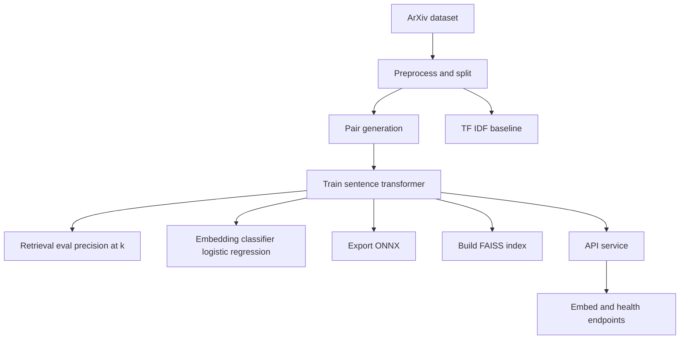

# Overview

## Goals and scope
This project fine tunes [Sentence Transformers](https://www.sbert.net/) models on arXiv titles and abstracts so that
papers from the same primary subject are close in embedding space, while unrelated subjects move apart. The learned
embeddings are
used for semantic retrieval, similarity search, and embedding-based classification.

## End-to-end flow

Implemented end-to-end:
- Preprocessing and pair generation pipeline.
- Training with retrieval evaluation during training.
- Embedding-based classifier (logistic regression) and TF-IDF baselines.
- Similarity search indexing with [FAISS](https://faiss.ai/) for fast retrieval.
- ONNX export and [ONNX Runtime](https://onnxruntime.ai/docs/) inference path alongside
  [Sentence Transformers](https://www.sbert.net/) inference.
- [FastAPI](https://fastapi.tiangolo.com/) service with `/health` and `/embed` endpoints.
- [Docker](https://docs.docker.com/) images for training and inference, CI pipeline for lint and tests.
- Model comparisons with larger transformer backbones.

## Inputs, outputs, and components
Inputs:
- `title`, `abstract`, `primary_subject`, `subjects`

Outputs:
- trained embedding models and ONNX exports
- pair datasets for contrastive learning
- retrieval and classification metrics, baseline reports, and API-ready artifacts
- similarity search indexes ([FAISS](https://faiss.ai/))

Core components:
- Data preprocessing that splits the dataset and builds contrastive or positive pairs.
- Training with `SentenceTransformerTrainer` and losses such as `MultipleNegativesRankingLoss` or `ContrastiveLoss`.
- Evaluation using `InformationRetrievalEvaluator` to report precision at k.
- Embedding-based classifier training and TF-IDF baseline evaluation.
- Similarity search indexing over normalized embeddings with [FAISS](https://faiss.ai/).
- ONNX export and [ONNX Runtime](https://onnxruntime.ai/docs/) helpers for CPU-friendly inference.
- [FastAPI](https://fastapi.tiangolo.com/) service that returns normalized embeddings for any abstract.

## Technology stack and dependencies
Core runtime:
- [PyTorch](https://pytorch.org/docs/stable/index.html) and [Accelerate](https://huggingface.co/docs/accelerate/index) for model training and runtime acceleration.
- [Transformers](https://huggingface.co/docs/transformers/index) and [Sentence Transformers](https://www.sbert.net/) for embedding models, losses, and trainers.
- [Datasets](https://huggingface.co/docs/datasets/) for dataset loading, slicing, and disk caching.
- [Hydra](https://hydra.cc/docs/intro/) for config composition and CLI overrides.
- [Loguru](https://github.com/Delgan/loguru) for structured logging to console and files.
- [FastAPI](https://fastapi.tiangolo.com/) and [Uvicorn](https://www.uvicorn.org/) for the embedding API service.
- [Weights & Biases](https://docs.wandb.ai/) for experiment tracking and metrics.
- [DVC](https://dvc.org/doc) with [dvc-gdrive](https://dvc.org/doc/user-guide/setup-gdrive-remote) for data versioning and remote storage.
- [Requests](https://requests.readthedocs.io/) for HTTP clients and integrations.
- [Invoke](https://www.pyinvoke.org/) for project task automation.
- [Typer](https://typer.tiangolo.com/) for lightweight CLI tooling and task entry points.
- [Jupyter](https://jupyter.org/) for exploratory notebooks.
- [ONNX Runtime](https://onnxruntime.ai/docs/) for exported model inference.
- [FAISS](https://faiss.ai/) for similarity search indexing.
- [scikit-learn](https://scikit-learn.org/stable/) for logistic regression and TF-IDF baselines.

Dev, quality, and docs:
- [pytest](https://docs.pytest.org/) and [coverage](https://coverage.readthedocs.io/) for tests and coverage reporting.
- [ruff](https://docs.astral.sh/ruff/) and [mypy](https://mypy.readthedocs.io/) for linting, formatting, and typing.
- [pre-commit](https://pre-commit.com/) for consistent local checks.
- [MkDocs](https://www.mkdocs.org/), [MkDocs Material](https://squidfunk.github.io/mkdocs-material/), and [mkdocstrings](https://mkdocstrings.github.io/python/) for documentation.

Tooling:
- [uv](https://docs.astral.sh/uv/getting-started/installation/) is used as the package manager and command runner in all examples.
