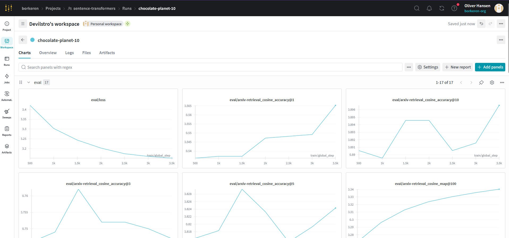
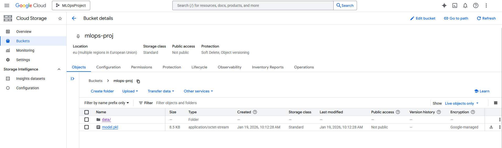
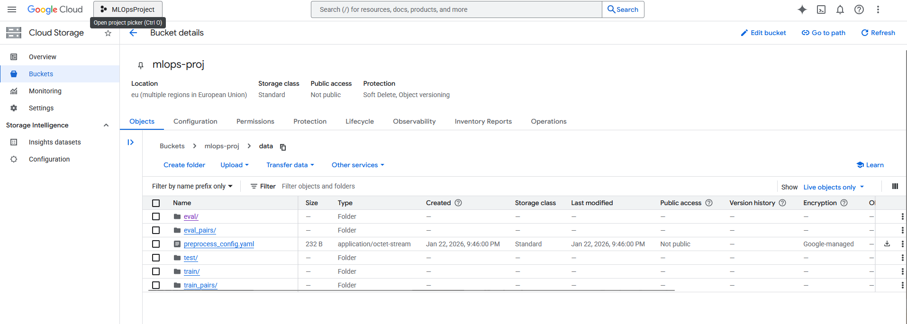
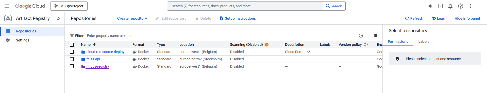
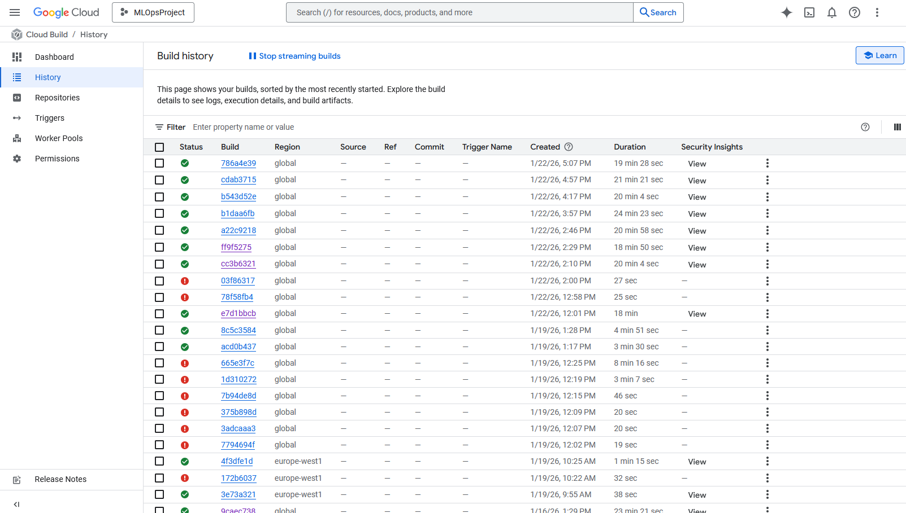
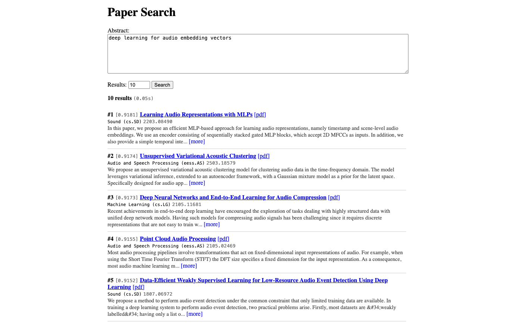
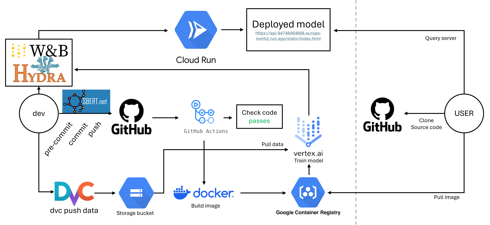

# Exam template for 02476 Machine Learning Operations

This is the report template for the exam. Please only remove the text formatted as with three dashes in front and behind
like:

```--- question 1 fill here ---```

Where you instead should add your answers. Any other changes may have unwanted consequences when your report is
auto-generated at the end of the course. For questions where you are asked to include images, start by adding the image
to the `figures` subfolder (please only use `.png`, `.jpg` or `.jpeg`) and then add the following code in your answer:

``

In addition to this markdown file, we also provide the `report.py` script that provides two utility functions:

Running:

```bash
python report.py html
```

Will generate a `.html` page of your report. After the deadline for answering this template, we will auto-scrape
everything in this `reports` folder and then use this utility to generate a `.html` page that will be your serve
as your final hand-in.

Running

```bash
python report.py check
```

Will check your answers in this template against the constraints listed for each question e.g. is your answer too
short, too long, or have you included an image when asked. For both functions to work you mustn't rename anything.
The script has two dependencies that can be installed with

```bash
pip install typer markdown
```

or

```bash
uv add typer markdown
```

## Overall project checklist

The checklist is *exhaustive* which means that it includes everything that you could do on the project included in the
curriculum in this course. Therefore, we do not expect at all that you have checked all boxes at the end of the project.
The parenthesis at the end indicates what module the bullet point is related to. Please be honest in your answers, we
will check the repositories and the code to verify your answers.

### Week 1

* [x] Create a git repository (M5)
* [x] Make sure that all team members have write access to the GitHub repository (M5)
* [x] Create a dedicated environment for you project to keep track of your packages (M2)
* [x] Create the initial file structure using cookiecutter with an appropriate template (M6)
* [x] Fill out the `data.py` file such that it downloads whatever data you need and preprocesses it (if necessary) (M6)
* [x] Add a model to `model.py` and a training procedure to `train.py` and get that running (M6)
* [x] Remember to either fill out the `requirements.txt`/`requirements_dev.txt` files or keeping your
    `pyproject.toml`/`uv.lock` up-to-date with whatever dependencies that you are using (M2+M6)
* [x] Remember to comply with good coding practices (`pep8`) while doing the project (M7)
* [x] Do a bit of code typing and remember to document essential parts of your code (M7)
* [x] Setup version control for your data or part of your data (M8)
* [x] Add command line interfaces and project commands to your code where it makes sense (M9)
* [x] Construct one or multiple docker files for your code (M10)
* [x] Build the docker files locally and make sure they work as intended (M10)
* [x] Write one or multiple configurations files for your experiments (M11)
* [x] Used Hydra to load the configurations and manage your hyperparameters (M11)
* [ ] Use profiling to optimize your code (M12)
* [x] Use logging to log important events in your code (M14)
* [x] Use Weights & Biases to log training progress and other important metrics/artifacts in your code (M14)
* [ ] Consider running a hyperparameter optimization sweep (M14)
* [ ] Use PyTorch-lightning (if applicable) to reduce the amount of boilerplate in your code (M15)

### Week 2

* [x] Write unit tests related to the data part of your code (M16)
* [x] Write unit tests related to model construction and or model training (M16)
* [x] Calculate the code coverage (M16)
* [x] Get some continuous integration running on the GitHub repository (M17)
* [x] Add caching and multi-os/python/pytorch testing to your continuous integration (M17)
* [x] Add a linting step to your continuous integration (M17)
* [x] Add pre-commit hooks to your version control setup (M18)
* [ ] Add a continues workflow that triggers when data changes (M19)
* [ ] Add a continues workflow that triggers when changes to the model registry is made (M19)
* [x] Create a data storage in GCP Bucket for your data and link this with your data version control setup (M21)
* [x] Create a trigger workflow for automatically building your docker images (M21)
* [x] Get your model training in GCP using either the Engine or Vertex AI (M21)
* [x] Create a FastAPI application that can do inference using your model (M22)
* [x] Deploy your model in GCP using either Functions or Run as the backend (M23)
* [x] Write API tests for your application and setup continues integration for these (M24)
* [x] Load test your application (M24)
* [x] Create a more specialized ML-deployment API using either ONNX or BentoML, or both (M25)
* [x] Create a frontend for your API (M26)

### Week 3

* [ ] Check how robust your model is towards data drifting (M27)
* [ ] Setup collection of input-output data from your deployed application (M27)
* [ ] Deploy to the cloud a drift detection API (M27)
* [x] Instrument your API with a couple of system metrics (M28)
* [x] Setup cloud monitoring of your instrumented application (M28)
* [x] Create one or more alert systems in GCP to alert you if your app is not behaving correctly (M28)
* [ ] If applicable, optimize the performance of your data loading using distributed data loading (M29)
* [ ] If applicable, optimize the performance of your training pipeline by using distributed training (M30)
* [x] Play around with quantization, compilation and pruning for you trained models to increase inference speed (M31)

### Extra

* [x] Write some documentation for your application (M32)
* [x] Publish the documentation to GitHub Pages (M32)
* [x] Revisit your initial project description. Did the project turn out as you wanted?
* [x] Create an architectural diagram over your MLOps pipeline
* [x] Make sure all group members have an understanding about all parts of the project
* [x] Uploaded all your code to GitHub

## Group information

### Question 1
> **Enter the group number you signed up on <learn.inside.dtu.dk>**
>
> Answer:

96

### Question 2
> **Enter the study number for each member in the group**
>
> Example:
>
> *sXXXXXX, sXXXXXX, sXXXXXX*
>
> Answer:

s224178, s194591, s224233, s224207

### Question 3
> **Did you end up using any open-source frameworks/packages not covered in the course during your project? If so**
> **which did you use and how did they help you complete the project?**
>
> Recommended answer length: 0-200 words.
>
> Example:
> *We used the third-party framework ... in our project. We used functionality ... and functionality ... from the*
> *package to do ... and ... in our project*.
>
> Answer:

In this project we used a third-party framework called `Sentence-Transformers`, a library with access to moderne models for embedding models. We used this to simplify and help make the model and training parts more streamlined with models that we could fine-tune to help with the goal of embedding ArXiv papers based on abstracts and subjects.

## Coding environment

> In the following section we are interested in learning more about you local development environment. This includes
> how you managed dependencies, the structure of your code and how you managed code quality.

### Question 4

> **Explain how you managed dependencies in your project? Explain the process a new team member would have to go**
> **through to get an exact copy of your environment.**
>
> Recommended answer length: 100-200 words
>
> Example:
> *We used ... for managing our dependencies. The list of dependencies was auto-generated using ... . To get a*
> *complete copy of our development environment, one would have to run the following commands*
>
> Answer:

We used UV to help manage all our dependencies; it is a modern and fast framework. We used it to streamline adding and updating packages we need between members, with a `pyproject.toml` and `uv.lock` making sure the exact same setup was used across our group. We served our code over `GitHub`, to help share code easily and manage any conflicts in approach we might have run into. To get a complete setup ready to go, one should with access to our repository on GitHub, and assuming UV is installed: `git clone REPO`, `cd MLOpsProject`, `uv sync`, `uv run src/mlops_project/data.py` to be ready and have all data processed. Unless Wandb logging is not wished, one should also `wandb logging` if not already done.

### Question 5

> **We expect that you initialized your project using the cookiecutter template. Explain the overall structure of your**
> **code. What did you fill out? Did you deviate from the template in some way?**
>
> Recommended answer length: 100-200 words
>
> Example:
> *From the cookiecutter template we have filled out the ... , ... and ... folder. We have removed the ... folder*
> *because we did not use any ... in our project. We have added an ... folder that contains ... for running our*
> *experiments.*
>
> Answer:

We did indeed initialize the project with a cookiecutter template, specifially the one [found here from the course](https://github.com/SkafteNicki/mlops_template). In this we filled out the `src/mlops_project`, `configs`, `data`, `tests`, and `dockerfiles`. We cache models in `models`, but that is done locally. When training, an `outputs` folder from `Hydra` is emitted with experiments, but that is not shared; as an extra, the training script allows for wandb logging (default). We have a few extra files for `dvc` and Google Cloud. We also have a few extra source files to help give more structure; for example `metrics.py`, `faiss_index.py`, and `index.py`, which is related to our API.

### Question 6

> **Did you implement any rules for code quality and format? What about typing and documentation? Additionally,**
> **explain with your own words why these concepts matters in larger projects.**
>
> Recommended answer length: 100-200 words.
>
> Example:
> *We used ... for linting and ... for formatting. We also used ... for typing and ... for documentation. These*
> *concepts are important in larger projects because ... . For example, typing ...*
>
> Answer:

We introduced quite a few rules for code quality and formatting. Mostly done by `Ruff` for linting/formatting and `Mypy` for type-checking; this is with pre-commit and in github action workflows both. NOAH MKDOCS HERE. In small projects, these can seem annoying, as checkers like `Mypy` can be really strict, and linters/formatters can make code "less" readable as opposed to how oneself writes. The purpose of these become much clearer when working in larger projects across longer times. They help provide a shared format of code, and makes sure the code is as self-documenting as possible. You can glance the input and return-types easily, without having to guess based on variable names. This can save considerable time and frustration when working with older code or code others have written.

## Version control

> In the following section we are interested in how version control was used in your project during development to
> corporate and increase the quality of your code.

### Question 7

> **How many tests did you implement and what are they testing in your code?**
>
> Recommended answer length: 50-100 words.
>
> Example:
> *In total we have implemented X tests. Primarily we are testing ... and ... as these the most critical parts of our*
> *application but also ... .*
>
> Answer:

We've implemented quite a few tests. In total we implemented 6 model tests, 34 data tests, and 6 API tests. Some of these run multiple times with different inputs. Primarily we are testing the data and its structure, as well as the model input/output shapes through mocks. These are important parts of the pipeline, as the data has to be correctly structured with the usage of `Sentence-Transformers` training losses. We did not do tests for the training loop, as that was outsourced to the `Trainer` class from `Sentence-Transformers` which is a reliable framework, building on top of Hugginface Trainer interface.

### Question 8

> **What is the total code coverage (in percentage) of your code? If your code had a code coverage of 100% (or close**
> **to), would you still trust it to be error free? Explain you reasoning.**
>
> Recommended answer length: 100-200 words.
>
> Example:
> *The total code coverage of code is X%, which includes all our source code. We are far from 100% coverage of our **
> *code and even if we were then...*
>
> Answer:

The total test coverage of the code is around 93%. This includes all the current source code found in `src/mlops_project/`. We aren't far from 100%, but the few different parts are entry points that simply run the different parts of the code we test, for example the `if __name__ == '__main__':` parts mainy. These entrypoints are usually run from the CLI and only serves to run a function like `preprocess` for data, that we test anyways. Say though that the code coverage was 100%, then we couldn't gurantee that our code runs without errors hencefourth. Usually in tests, we also "mock" data (see `tests/conftest.py`) and that means that we might miss an edgecase of data, if we are not careful.

### Question 9

> **Did you workflow include using branches and pull requests? If yes, explain how. If not, explain how branches and**
> **pull request can help improve version control.**
>
> Recommended answer length: 100-200 words.
>
> Example:
> *We made use of both branches and PRs in our project. In our group, each member had an branch that they worked on in*
> *addition to the main branch. To merge code we ...*
>
> Answer:

We did as much as possible try to use branches and pull requests, if not to not constantly introduce merge commits, then to at least help isolate features to a branch which when done, can be merged into master. We usually just create a new branch when working on something new, for example a google cloud building flow, or an Onnx feature, and then when done, we can merge it into master. We didn't introduce branch safety such as requiring other memebers to go through and review the code, though that can be smart in larger projects with production code that is more vulnerable to breaks.

### Question 10

> **Did you use DVC for managing data in your project? If yes, then how did it improve your project to have version**
> **control of your data. If no, explain a case where it would be beneficial to have version control of your data.**
>
> Recommended answer length: 100-200 words.
>
> Example:
> *We did make use of DVC in the following way: ... . In the end it helped us in ... for controlling ... part of our*
> *pipeline*
>
> Answer:

Yes, `DVC` was set up to allow one to push and pull data from the projects preprocessed part into a cloud bucket with `DVC`. To be fair, it did not have a huge impact on the project to introduce it, but it did streamline the process of moving from/to the cloud. It wouldn't be much harder to utilize the `gcloud` CLI to do it, but at least this introduces version control, and allows sharing the data `.dvc` file over GitHub. Version controlling, including data, will always be valuabel if different data is processed differently, to have a history of data manipulations, or if something breaks the data processsor, one can always recover an earlier, working version of the data.

### Question 11

> **Discuss you continuous integration setup. What kind of continuous integration are you running (unittesting,**
> **linting, etc.)? Do you test multiple operating systems, Python  version etc. Do you make use of caching? Feel free**
> **to insert a link to one of your GitHub actions workflow.**
>
> Recommended answer length: 200-300 words.
>
> Example:
> *We have organized our continuous integration into 3 separate files: one for doing ..., one for running ... testing*
> *and one for running ... . In particular for our ..., we used ... .An example of a triggered workflow can be seen*
> *here: <weblink>*
>
> Answer:

Yes, we did end up building a complete continuous integration setup. This included a combination of linting with `Ruff`, formatting with `Ruff` and type-checking with a github action mirror of `Mypy`. We also run `pytest` across windows, ubuntu and macos (latest) to ensure it builds on all the three OS - which are also covered by the individual members of the group. These are "just" mirrors of the pre-commit setup, making sure that we conform to the same standards across our project. We used cache mounting to help speed up the actions as much as possible between runs, as they are mostly identical. We also added a complete `build` step for building our docker image for training in google cloud. This required an authenticated workflow with a service account. This step was considerably slower than the rest, as CUDA images are expensive to build. In case we couldn't cache, we wanted to reduce the amount of time spent doing this. This meant we approached differently at some point, by making sure we did more feature branches and PRs to not build as many images every time a small change was pushed. We do not test across multiple python version as we simply require python 3.12 as the only we use. It is generally best to enforce a single major python version in larger projects. An example of a complete triggered workflow can be seen [here](https://github.com/Neismo/MLOpsProject/actions/runs/21245846868).

## Running code and tracking experiments

> In the following section we are interested in learning more about the experimental setup for running your code and
> especially the reproducibility of your experiments.

### Question 12

> **How did you configure experiments? Did you make use of config files? Explain with coding examples of how you would**
> **run a experiment.**
>
> Recommended answer length: 50-100 words.
>
> Example:
> *We used a simple argparser, that worked in the following way: Python  my_script.py --lr 1e-3 --batch_size 25*
>
> Answer:

To run simple processes like data preprocessing steps, we made use of `Typer`. It's a very simple CLI library from the same author as `FastAPI`. This allowed us to run those files as neede with command line arguments like `uv run src/mlops_project/data.py --num_pairs=50000`. Otherwise, mostly for training, we use HydraConfig. This simply allows to run different configurations, and each will be saved to an `output` folder sepereted by dates and timestamps, allowing a good, albeit poluted, way to organize different experiments. The different configs are seen in the `configs` folder.

### Question 13

> **Reproducibility of experiments are important. Related to the last question, how did you secure that no information**
> **is lost when running experiments and that your experiments are reproducible?**
>
> Recommended answer length: 100-200 words.
>
> Example:
> *We made use of config files. Whenever an experiment is run the following happens: ... . To reproduce an experiment*
> *one would have to do ...*
>
> Answer:

Reproducibility of experiments is indeed an important part. We introduced seeded runs to help make sure that our experiments were reproducible. These are seen in the different configs. These config files also include different parameters such as the number of training and testing pairs, which loss type we are using, `batch_size` et cetera. To reproduce a run, one would have to look at the config file, at set the appropriate parts to the values, most importantly being the `batch_size`, `seed` and `loss`. Tests were written to do check for it in the data generation, which can be seen in the pretty volomous `test/test_data.py` file, that really ensures that data generates and conforms to the format we expect it to be in.

### Question 14

> **Upload 1 to 3 screenshots that show the experiments that you have done in W&B (or another experiment tracking**
> **service of your choice). This may include loss graphs, logged images, hyperparameter sweeps etc. You can take**
> **inspiration from [this figure](figures/wandb.png). Explain what metrics you are tracking and why they are**
> **important.**
>
> Recommended answer length: 200-300 words + 1 to 3 screenshots.
>
> Example:
> *As seen in the first image when have tracked ... and ... which both inform us about ... in our experiments.*
> *As seen in the second image we are also tracking ... and ...*
>
> Answer:

Some of the most important things to look for when training is that the loss on evaluation (and train for that matter) is decreasing. This is a sign that the model _is_ learning something, and that it is correctly aligning data in the embedding space. A decreasing loss indicates the model is pushing similar abstracts closer together while separating dissimilar ones in the vector space. We furthermore look at some top _k_ metrics like accuracy and recall. These are easier to interpret, and we would ideally like to see these increasing as the model trains. It usually does this. The different values of _k_ (e.g., top1, top5, top10) help us understand retrieval quality at different granularities. top10 should be high indicating good general retrieval, while top1 being more volatile during training reflects the difficulty of exact matching. We also track the learning rate schedule and batch processing times to ensure training is progressing smoothly without any bottlenecks. Additionally, W&B allows us to compare multiple runs side-by-side, which was useful when experimenting with different loss functions (MultipleNegativesRankingLoss vs others) and hyperparameters like batch size and learning rate. The platform also made it easy to share results with team members. An example of a run can be seen right here: 

### Question 15

> **Docker is an important tool for creating containerized applications. Explain how you used docker in your**
> **experiments/project? Include how you would run your docker images and include a link to one of your docker files.**
>
> Recommended answer length: 100-200 words.
>
> Example:
> *For our project we developed several images: one for training, inference and deployment. For example to run the*
> *training docker image: `docker run trainer:latest lr=1e-3 batch_size=64`. Link to docker file: <weblink>*
>
> Answer:

Docker is a powerful tool to create containerized applications. It also serves to help reduce the problems of some code running and working on one machine, but fails in another. We've used docker mostly to demonstrate our knowledge of it, but not so much practically. We build two docker images; one for training with CUDA, and one for serving a model over a FastAPI application. To run either of the docker images locally, one would have to first call `docker build -f dockerfiles/***.dockerfile . -t ***:latest` to build the latest image of either `train.dockerfile` or `api.dockerfile`. To run either, now refer to them by the image name and do `docker run ***:latest` depending on which service. The training script requres authentication with google cloud for secrets, which is infered during google cloud build. If run locally, be sure to be logged in with `gcloud auth`.

### Question 16

> **When running into bugs while trying to run your experiments, how did you perform debugging? Additionally, did you**
> **try to profile your code or do you think it is already perfect?**
>
> Recommended answer length: 100-200 words.
>
> Example:
> *Debugging method was dependent on group member. Some just used ... and others used ... . We did a single profiling*
> *run of our main code at some point that showed ...*
>
> Answer:

When it was convenient, which it usually was, we worked in notebooks to get a feeling for the flow, how input and output was to the various third party packages, and how interfacing between them were done. This gives a good overview and quick way to test stuff, after which it could be added to scripts where it mimicked what we did in those. Some things weren't always clear, for example we could build CUDA images locally which worked, but failed in the cloud. These were a bit harder to debug other than trying to discern the error, fix it, and try again.

## Working in the cloud

> In the following section we would like to know more about your experience when developing in the cloud.

### Question 17

> **List all the GCP services that you made use of in your project and shortly explain what each service does?**
>
> Recommended answer length: 50-200 words.
>
> Example:
> *We used the following two services: Engine and Bucket. Engine is used for... and Bucket is used for...*
>
> Answer:

We used the following google cloud services: `Engine`, `Bucket`, `Registry`, `Build`, `Vertex AI`, `Run`. `Engine` allowed us to do runs of our built training CUDA images, and to do training loops. As previously stated, we opted to do local or HPC runs instead, as we had resources for it, and running over cloud can be expensive, when free alternatives that work are available; however, we figured we didn't need CUDA images that were heavy, but rather just CUDA availability, so that saved a lot of time, and allowed for runnign `Vertex AI` scripts; these are configured runs that requests resources, loads up an instance and runs an image, then collects and reports results, and then closes; all in one single swoop. `Bucket` is for storing our data and models; this could be synced with `DVC` or manually with `gcloud` CLI. The buckets can be mounted to run images, which is very convenient when training and having to save/load data and models. `Registry` and `Build` was used when pushing to the master branch to build the docker images and push them to the registry, where we could build and serve them using the `Run` service for the public REST API.

### Question 18

> **The backbone of GCP is the Compute engine. Explained how you made use of this service and what type of VMs**
> **you used?**
>
> Recommended answer length: 100-200 words.
>
> Example:
> *We used the compute engine to run our ... . We used instances with the following hardware: ... and we started the*
> *using a custom container: ...*
>
> Answer:

We did not really explicitly use Compute Engine, but we did use it through Vertex AI. We used instances utilizing the NVIDIA GPU V100 to faciliate training our embedding models based on the data stored in the bucket. We use the docker image found in `dockerfiles/train.dockerfile` to built an image with CUDA simply training through `src/mlops_project/train.py`. The type of VMs we would ideally like to have used, were we to use this service directly, we would mirror our `Vertex AI` setup with GPU instances running a single Nvidia V100 GPUs for training, and otherwise just default CPU setup as in our vertex AI setup.

### Question 19

> **Insert 1-2 images of your GCP bucket, such that we can see what data you have stored in it.**
> **You can take inspiration from [this figure](figures/bucket.png).**
>
> Answer:

 

### Question 20

> **Upload 1-2 images of your GCP artifact registry, such that we can see the different docker images that you have**
> **stored. You can take inspiration from [this figure](figures/registry.png).**
>
> Answer:



### Question 21

> **Upload 1-2 images of your GCP cloud build history, so we can see the history of the images that have been build in**
> **your project. You can take inspiration from [this figure](figures/build.png).**
>
> Answer:



### Question 22

> **Did you manage to train your model in the cloud using either the Engine or Vertex AI? If yes, explain how you did**
> **it. If not, describe why.**
>
> Recommended answer length: 100-200 words.
>
> Example:
> *We managed to train our model in the cloud using the Engine. We did this by ... . The reason we choose the Engine*
> *was because ...*
>
> Answer:

We did manage to train and store our model in the cloud using Vertex AI. It did take some struggle at first, as getting the CUDA image from NVIDIA working was challenging, but we were able to get it to work by using a cuDNN image on the latest stable Ubuntu image with Python 3.12. This allowed us to run and train the models on cloud GPUs, and load and save them in the associated bucket we showed earlier. We also opted for a programmatic approach to secrets, managing the `wandb_api_key` through Google Secret Manager, as opposed to a `vertex.yaml` approach with substitution shown in exercises.

## Deployment

### Question 23

> **Did you manage to write an API for your model? If yes, explain how you did it and if you did anything special. If**
> **not, explain how you would do it.**
>
> Recommended answer length: 100-200 words.
>
> Example:
> *We did manage to write an API for our model. We used FastAPI to do this. We did this by ... . We also added ...*
> *to the API to make it more ...*
>
> Answer:

We have written and deployed an API for our embeddings model through the `Cloud Run` services. For this, FastAPI was used. We also have a simple front-end to go with it, to allow one to search for similar scientific papers based on abstracts. A list of the top 10 results will be shown, as can be seen here:



We have two endpoints, `POST /embed` and `POST /search`; the latter is used by the index page to emit a POST request and show the top 10 results. The first one is used to fetch the embedding for an abstract given by `{"abstract": ""}` post body.

### Question 24

> **Did you manage to deploy your API, either in locally or cloud? If not, describe why. If yes, describe how and**
> **preferably how you invoke your deployed service?**
>
> Recommended answer length: 100-200 words.
>
> Example:
> *For deployment we wrapped our model into application using ... . We first tried locally serving the model, which*
> *worked. Afterwards we deployed it in the cloud, using ... . To invoke the service an user would call*
> *`curl -X POST -F "file=@file.json"<weburl>`*
>
> Answer:

We did a full deployment of our trained application as said above by the `Cloud Run` services. A local run was first performed by `s224233` to make sure it worked and was ready to be deployed. Afterwards, the image for serving it was pushed to the artifacts registry, after which a services was started from that image, allowing updates if updated images was pushed. To invoke the service, one would run `curl -X 'POST' 'https://faiss-api-94748064668.europe-north2.run.app/search' -H 'accept: application/json' -H 'Content-Type: application/json' -d '{"abstract": "some abstract here","k": k,"nprobe": 1}'` and you would get a `{[{"title", "abstract", "primary_subject", "subjects", "arxiv_id"}] * k}` based on similarity scores.

### Question 25

> **Did you perform any unit testing and load testing of your API? If yes, explain how you did it and what results for**
> **the load testing did you get. If not, explain how you would do it.**
>
> Recommended answer length: 100-200 words.
>
> Example:
> *For unit testing we used ... and for load testing we used ... . The results of the load testing showed that ...*
> *before the service crashed.*
>
> Answer:

We did not perform any load testing for the API. Load testing, however, is important for all APIs, but especially public ones. An approach to load testing would for example be the framework `locust`. The `locust` framework that allows one to send many requests simultaneously and keep the connections open for specified amount of time. This "blocks" other connections and can make the API very annoying to use for other users. This highlights areas of interest to keep the API responsive and fast, for example making limits on how long a connection can stay open, or how long between data transfers (see [slowloris attacks](https://www.cloudflare.com/learning/ddos/ddos-attack-tools/slowloris/)) amongst others.

### Question 26

> **Did you manage to implement monitoring of your deployed model? If yes, explain how it works. If not, explain how**
> **monitoring would help the longevity of your application.**
>
> Recommended answer length: 100-200 words.
>
> Example:
> *We did not manage to implement monitoring. We would like to have monitoring implemented such that over time we could*
> *measure ... and ... that would inform us about this ... behaviour of our application.*
>
> Answer:

In short, we set up a simple alert system when the amount of requests (logs) from the API service was above a certain threshold. We also added basics Prometheus monitoring of metrics, to see the requests counts for the different endpoints. The alert system was working well, and was tested. See for example below. It would have been ideal to implement more metrics to watch over, for example which parts of the requests took longer, and also more appropriate load balancing, but these are a little more extensive. For example rate-limiting to avoid the worst cases of DDOS, but we wanted to focus our time elsewhere. 

## Overall discussion of project

> In the following section we would like you to think about the general structure of your project.

### Question 27

> **How many credits did you end up using during the project and what service was most expensive? In general what do**
> **you think about working in the cloud?**
>
> Recommended answer length: 100-200 words.
>
> Example:
> *Group member 1 used ..., Group member 2 used ..., in total ... credits was spend during development. The service*
> *costing the most was ... due to ... . Working in the cloud was ...*
>
> Answer:

The most expensive services were generally the `Vertex AI` and also the `Cloud Run` services. This is of course due to renting GPUs on an hourly basis, and running containerized images. We ended up racking up around 100+ (UPDATE THIS TO CURRENT) by the end of this project, which is not too bad, but we also had short training times. Working in the cloud has its perks, that things should just work and are running, but it can be incredibly infuriating when things are not explained well, break down with unreadable error messages, or long wait times just to see a "permission denied" due to a missing role. The prices are also quite high compared to competitors, but it is Google after all.

### Question 28

> **Did you implement anything extra in your project that is not covered by other questions? Maybe you implemented**
> **a frontend for your API, use extra version control features, a drift detection service, a kubernetes cluster etc.**
> **If yes, explain what you did and why.**
>
> Recommended answer length: 0-200 words.
>
> Example:
> *We implemented a frontend for our API. We did this because we wanted to show the user ... . The frontend was*
> *implemented using ...*
>
> Answer:

We built a semantic paper search system using FAISS as our vector database, indexing ~2.5 million arXiv paper embeddings from our fine-tuned model. The IndexIVFFlat index with 4096 clusters gives us fast approximate nearest neighbor search at scale. Paper metadata is stored in SQLite for efficient lazy-loading, keeping memory usage low.

A web frontend lets users paste an abstract or sentence to find semantically similar papers, displaying similarity scores and direct links to arXiv pages and PDFs. This turns our trained embedding model into a practical research tool.


### Question 29

> **Include a figure that describes the overall architecture of your system and what services that you make use of.**
> **You can take inspiration from [this figure](figures/overview.png). Additionally, in your own words, explain the**
> **overall steps in figure.**
>
> Recommended answer length: 200-400 words
>
> Example:
>
> *The starting point of the diagram is our local setup, where we integrated ... and ... and ... into our code.*
> *Whenever we commit code and push to GitHub, it auto triggers ... and ... . From there the diagram shows ...*
>
> Answer:

An overview of the architecture of our system can be seen here: 

The starting point is local development, where we use `uv` for dependency management and `pre-commit` hooks for code quality (Ruff linting/formatting, Mypy type-checking). Code follows a cookiecutter template with clear separation between source code, tests, configs, and dockerfiles. When we push code to GitHub, it triggers our CI/CD pipeline through GitHub Actions. The pipeline runs tests across Windows, Ubuntu, and macOS, performs linting checks, and builds Docker images. For training, a dedicated workflow builds a CUDA-enabled Docker image and pushes it to Google Artifact Registry.

From Artifact Registry, the training image is deployed to Vertex AI for model training. The training job pulls data from Google Cloud Storage buckets (where our preprocessed arXiv dataset resides), trains the SentenceTransformer model, and logs metrics to Weights & Biases for experiment tracking. The trained model artifacts are saved back to Cloud Storage.

For serving, a separate API Docker image is built and deployed to Cloud Run. This containerized FastAPI application loads the trained model and FAISS index from Cloud Storage at startup. The API exposes endpoints for embedding generation and semantic search, with Prometheus metrics for monitoring. A web frontend is served alongside the API, allowing users to search for similar papers. Data versioning is handled through DVC with remote storage in Google Cloud Storage.

### Question 30

> **Discuss the overall struggles of the project. Where did you spend most time and what did you do to overcome these**
> **challenges?**
>
> Recommended answer length: 200-400 words.
>
> Example:
> *The biggest challenges in the project was using ... tool to do ... . The reason for this was ...*
>
> Answer:

Most of the frustrations came with working with Google Cloud. The cloud interface was slow and annoying to work with generally, and different parts failed at different times, usually after a long wait, with errors that weren't always human readable. This meant a lot of time was spent waiting for failure/success and debugging the errors we eventually received. Permissions were a bit annoying as well, albeit easily passed if `owner` role was given out freely.

Getting the CUDA-enabled Docker image to work properly was particularly challenging. The combination of NVIDIA base images, cuDNN, Python 3.12, and our specific dependencies required multiple iterations to get right. Build times were long, making the feedback loop painful. We eventually settled on a multi-stage build approach to keep the final image size manageable while including all necessary CUDA libraries.

Another significant challenge was coordinating work across team members with different development environments (Windows, macOS, Linux). While Docker helped with deployment consistency, local development still had quirks, especially around GPU access and path handling. Our CI pipeline testing across all three operating systems caught several of these issues early.

The Vertex AI integration also required careful handling of secrets and authentication. We spent time debugging authentication issues between GitHub Actions, Artifact Registry, and Vertex AI. The programmatic approach to secret management (using Google Secret Manager) ended up being more reliable than YAML substitution patterns.

Finally, managing the large arXiv dataset (2.5M+ papers) required attention to memory efficiency. We implemented streaming data loading and used SQLite for metadata storage to avoid loading everything into memory at once.

### Question 31

> **State the individual contributions of each team member. This is required information from DTU, because we need to**
> **make sure all members contributed actively to the project. Additionally, state if/how you have used generative AI**
> **tools in your project.**
>
> Recommended answer length: 50-300 words.
>
> Example:
> *Student sXXXXXX was in charge of developing of setting up the initial cookie cutter project and developing of the*
> *docker containers for training our applications.*
> *Student sXXXXXX was in charge of training our models in the cloud and deploying them afterwards.*
> *All members contributed to code by...*
> *We have used ChatGPT to help debug our code. Additionally, we used GitHub Copilot to help write some of our code.*
> Answer:

Student s194591 worked on the continuous integrations, project structure, large parts of the testing and parts of the google cloud integration; this included workflows to test, lint and build images, syncing data and setting up auto-building images to the cloud. s224178 worked on Vertex AI training, config files for training, Docker, linting and testing, API development, created a project diagram, and contributed to debugging GPU and environment setup for cloud-based model training. s224207 worked on Docker (training image), ONNX integration (model export and runtime support) with related CI testing, Hydra configs, and the project documentation pipeline, including MkDocs updates and GitHub Pages setup. s224233 worked on training and data scripts, API/frontend, cloud run deployment, vector DB (FAISS) and visualization. Across the project, AI tools such as ChatGPT, Claude, and Gemini were used to support development through debugging assistance, code generation, configuration troubleshooting, and documentation drafting, while all final implementations and decisions were made and validated by the team.
